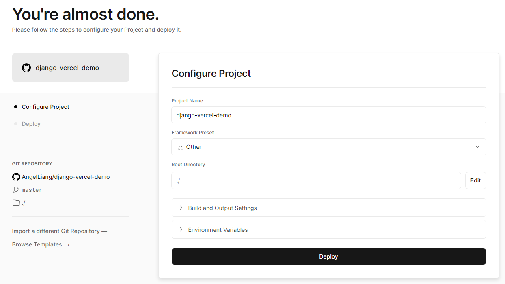
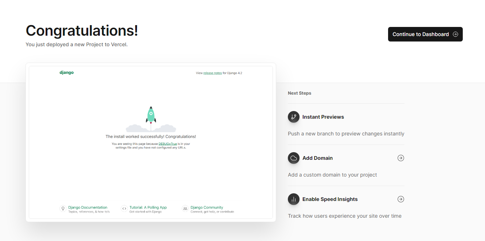

# 在vercel部署django示例

20240619：现在需要配置nodejs为18.x才可以部署。

## 部署所需文件

1、 requirements.txt
2、 vercel_build.sh
3、 vercel.json
4、 修改wsgi.py
5、 修改settings.py

## 添加 vercel.json 和 vercel_build.sh

添加这两个文件，用于配置vercel

vercel.json 用于配置vercel

```json
{
    "version": 2,
    "builds": [
        {
        "src": "config/wsgi.py",
        "use": "@vercel/python",
        "config": { "maxLambdaSize": "15mb", "runtime": "python3.9" }
        },
        {
        "src": "vercel_build.sh",
        "use": "@vercel/static-build",
        "config": {
            "distDir": "staticfiles"
            }
        }
    ],
    "routes": [
        {
        "src": "/static/(.*)",
        "dest": "/$1"
        },
        {
        "src": "/(.*)",
        "dest": "config/wsgi.py"
        }
    ]
}
```

vercel_build.sh 用于安装依赖库，收集静态资源文件

```
pip install -r requirements.txt
python3.9 manage.py collectstatic --noinput
```

## 修改wsgi.py

需要在wsgi.py文件里添加app变量

```python
application = get_wsgi_application()

# 添加这一句
app = application
```

## 如何处理静态文件

vercel处理django的静态文件，需要修改setttings.py

添加收集静态文件的配置，收集到 staticfiles 文件夹

```python
STATIC_ROOT = BASE_DIR / 'staticfiles'
STATICFILES_DIRS = [BASE_DIR / 'static']
```

## 如何处理数据库配置

如果不使用数据库，需要去掉默认的sqlite配置

```python
DATABASES = {
    # 'default': {
    #     'ENGINE': 'django.db.backends.sqlite3',
    #     'NAME': BASE_DIR / 'db.sqlite3',
    # }
}
```

如果需要使用 vercel 的 postgresql 数据库，在 vercel 配置好数据库后，修改 settings.py 。

注意，连接 vercel 的 postgresql 数据库需要安全链接

```python
DATABASES = {
    'default': {
        'ENGINE': 'django.db.backends.postgresql_psycopg2',
        'NAME': os.getenv('POSTGRES_DATABASE', 'verceldb'),
        'USER': os.getenv('POSTGRES_USER', 'default'),
        'PASSWORD': os.getenv('POSTGRES_PASSWORD', 'postgres'),
        'HOST': os.getenv('POSTGRES_HOST', '127.0.0.1'),
        'PORT': int(os.getenv('POSTGRES_PORT', 5432)),
        # vercel 的 postgresql 需要安全链接
        'OPTIONS': {'sslmode': 'require'},
    }
}
```

之后执行下面命令进行数据库迁移

```
python manage.py makemigrations
python manage.py migrate
```

## vercel部署截图

配置截图



部署成功截图




## 参考资料

- https://dev.to/ksharma20/how-to-deploy-a-django-web-app-on-vercel-for-free-4fhe
